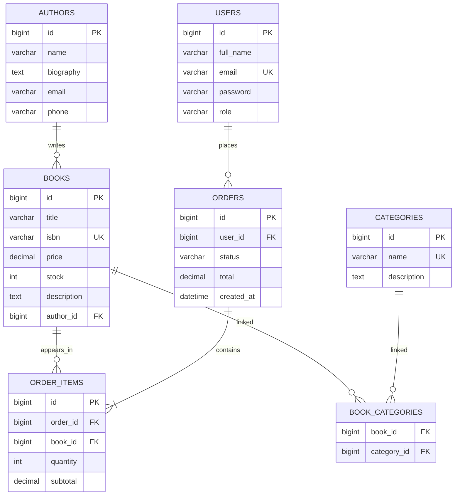

# Bookstore API - Taller 20 paginas

API REST para una libreria en linea construida con Spring Boot, JWT, JPA y validaciones.

## 1. Descripcion

El proyecto implementa:

- Autenticacion y autorizacion con JWT.
- Gestion de autores, categorias y libros.
- Flujo de pedidos con estados de negocio.
- Respuestas estandarizadas para exito y error.
- Documentacion OpenAPI (Swagger UI).

## 2. Stack Tecnologico

- Java 17+
- Spring Boot
- Spring Security (JWT)
- Spring Data JPA
- Jakarta Validation
- Lombok
- springdoc-openapi

## 3. Ejecucion

> Nota: este repositorio contiene el codigo fuente del modulo principal. Si ya tienes el archivo de build (Maven/Gradle) en tu entorno, ejecuta con ese flujo.

Pasos tipicos con Maven:

```bash
mvn clean install
mvn spring-boot:run
```

Aplicacion en:

- `http://localhost:8080`

Documentacion API:

- `http://localhost:8080/swagger-ui/index.html`
- `http://localhost:8080/swagger-ui.html`
- `http://localhost:8080/v3/api-docs`

## 4. Seguridad

### Roles

- `ROLE_ADMIN`
- `ROLE_USER`

### Header JWT

```http
Authorization: Bearer <token>
```

### Endpoints publicos

- `POST /auth/register`
- `POST /auth/login`
- `GET /books/**`
- `GET /authors/**`
- `GET /categories/**`

### Endpoints protegidos

- Admin CRUD: `POST|PUT|DELETE /books/**`, `POST|PUT|DELETE /authors/**`, `POST|PUT|DELETE /categories/**`
- Pedidos:
	- `POST /orders` (usuario autenticado)
	- `GET /orders/my` (usuario autenticado)
	- `GET /orders` (solo admin)
	- `PATCH /orders/{id}/confirm` (solo admin)
	- `PATCH /orders/{id}/cancel` (usuario autenticado, propietario o admin)

### Usuarios de demo (seed)

- Admin:
	- Email: `admin@bookstore.com`
	- Password: `Admin123*`
- Usuario:
	- Email: `user@bookstore.com`
	- Password: `User1234*`

## 5. Modelo de Respuesta

### Exito

```json
{
	"status": "success",
	"code": 200,
	"message": "Operacion exitosa",
	"data": {},
	"timestamp": "2026-04-22T10:00:00Z"
}
```

### Error

```json
{
	"status": "error",
	"code": 400,
	"message": "Error de validacion",
	"errors": ["field: must not be blank"],
	"timestamp": "2026-04-22T10:00:00Z",
	"path": "/books"
}
```

## 6. Endpoints Principales

## Autenticacion

- `POST /auth/register`
- `POST /auth/login`

Body `register`:

```json
{
	"fullName": "Usuario Ejemplo",
	"email": "user@example.com",
	"password": "Password123*"
}
```

Body `login`:

```json
{
	"email": "admin@bookstore.com",
	"password": "Admin123*"
}
```

## Libros

- `GET /books?authorId=&categoryId=&page=0&size=10`
- `GET /books/{id}`
- `POST /books` (admin)
- `PUT /books/{id}` (admin)
- `DELETE /books/{id}` (admin)

Body `book`:

```json
{
	"title": "Clean Code",
	"isbn": "9780132350884",
	"price": 79.9,
	"stock": 20,
	"description": "Libro sobre buenas practicas",
	"authorId": 1,
	"categoryIds": [1, 2]
}
```

## Autores

- `GET /authors`
- `GET /authors/{id}`
- `GET /authors/{id}/books`
- `POST /authors` (admin)
- `PUT /authors/{id}` (admin)
- `DELETE /authors/{id}` (admin)

Body `author`:

```json
{
	"name": "Nombre Autor",
	"biography": "Biografia corta",
	"email": "autor@example.com",
	"phone": "3001234567"
}
```

## Categorias

- `GET /categories`
- `GET /categories/{id}`
- `GET /categories/{id}/books`
- `POST /categories` (admin)
- `PUT /categories/{id}` (admin)
- `DELETE /categories/{id}` (admin)

Body `category`:

```json
{
	"name": "Tecnologia",
	"description": "Libros de software y tecnologia"
}
```

## Pedidos

- `POST /orders` (auth)
- `GET /orders/my` (auth)
- `GET /orders` (admin)
- `PATCH /orders/{id}/confirm` (admin)
- `PATCH /orders/{id}/cancel` (auth)

Body `order`:

```json
{
	"items": [
		{
			"bookId": 1,
			"quantity": 2
		},
		{
			"bookId": 2,
			"quantity": 1
		}
	]
}
```

## 7. ER Diagram (Mermaid)


## 8. Estructura del Proyecto

```text
com/taller/bookstore
|- config
|- controller
|- dto/request
|- dto/response
|- entity
|- exception/custom
|- exception/handler
|- mapper
|- repository
|- security
|- service/impl
```